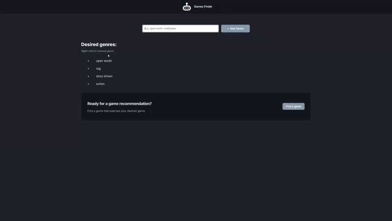

# Game Finder - AI-Powered Recommendations
An AI-powered game recommendation app that suggests games based on user-specified genres and features.

## Preview

## Info
**Tech:** React, CSS (Flexbox, Animations), JavaScript  
**Focus:** API integration, form handling, AI interaction  
**Libraries:** Hugging Face Inference API, react-markdown

## Features
- Add multiple game genres/features via input form
- Right-click to remove genres from list
- AI-powered recommendations using Llama 3.2 model
- Formatted markdown responses with game details
- Loading state with animated spinner
- Smooth scroll to recommendations
- Minimum 4 genres required for search

## Improvements Made
- **Loading state** – Added spinner animation while AI processes request
- **Dark theme** – Modern card-based design with dark backgrounds
- **Improved styling** – Hover effects, smooth transitions, and visual polish
- **Right-click deletion** – Remove genres from list with right-click context menu
- **Enhanced UX** – Smooth scroll behavior and clear user hints

## What I Learned
- Integrating external APIs (Hugging Face)
- Managing async operations with loading states
- React form actions and FormData API
- useEffect for side effects and scroll behavior
- useRef for DOM manipulation
- Rendering markdown content dynamically
- Environment variables for API keys
- Context menu event handling

## Links
[View Project](#) | [Back to Main Projects List](../README.md)