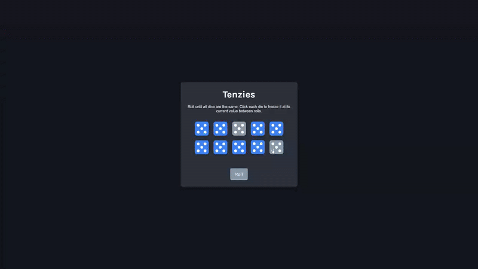

# Tenzies - Dice Game
An interactive dice game built with React where players roll until all dice show the same number.

## Preview

## Info
**Tech:** React, CSS (Grid, Flexbox, Transitions), JavaScript  
**Focus:** State management, conditional rendering, game logic  
**Libraries:** nanoid, react-confetti

## Features
- Roll 10 dice simultaneously
- Click dice to freeze them at current value
- Roll unfrozen dice until all match
- Confetti animation on win
- Realistic die faces with dot patterns
- Smooth transitions and hover effects

## Improvements Made
- **Realistic dice rendering** – CSS Grid-based dot layout mimicking real dice
- **Dark theme** – Modern UI with smooth animations

## What I Learned
- React state management with useState
- Conditional rendering based on game state
- Array manipulation with map() and every()
- Component composition
- CSS Grid for complex layouts
- Immutable state updates

## Links
[View Project](#) | [Back to Main Projects List](../README.md)